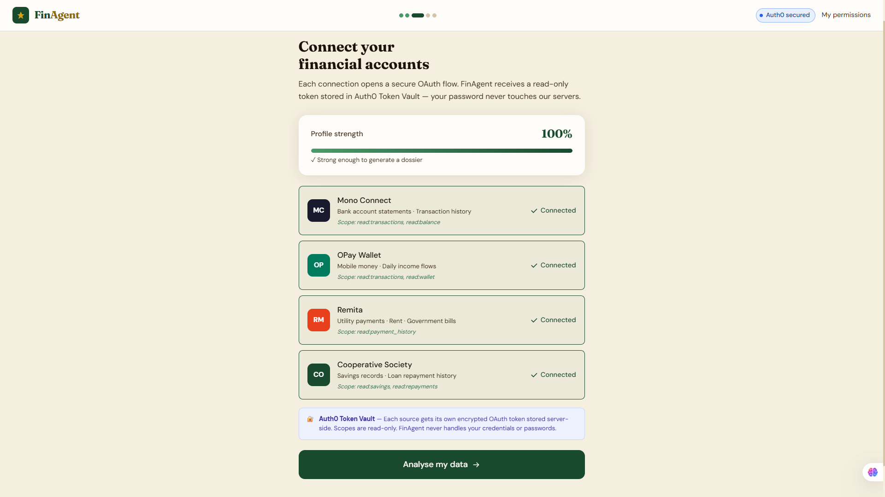

# FinAgent 🌟

**Your financial story. Your control.**

AI-powered credit dossiers for Nigeria's 50 million informal economy workers.

**Live app:** [finagent-phi.vercel.app](https://finagent-phi.vercel.app) &nbsp;|&nbsp; **Built for:** Auth0 "Authorized to Act" Hackathon 2026



---

## The problem

Adunola sells fabric at Oje Market in Ibadan. She earns ₦184,000/month, pays every utility bill on time, and saves with her cooperative society. She has done this for nearly a decade.

Last month, her bank said no to a ₦500,000 business loan. The reason: no payslip. No formal credit history.

There are **50 million Adunolas** in Nigeria - 80% of the workforce, ₦1.8 trillion in annual informal trade, and a $240 billion SME financing gap across Sub-Saharan Africa.

> *Consent is not a checkbox. It is trust infrastructure.*

---

## What FinAgent does

FinAgent connects a trader's financial accounts through **Auth0 Token Vault** - OPay mobile wallet, Mono bank statements, Remita utility payments, cooperative savings records - then runs an AI agent to analyse their financial history and generate a structured credit dossier that banks can evaluate.

Every step requires explicit consent. Every token access is logged. Every bank submission requires real-time approval on the user's registered device via **Auth0 CIBA**.

---

## Auth0 for AI Agents features used

| Feature | How FinAgent uses it |
|---|---|
| **Token Vault** | One encrypted, read-only OAuth token per data source. Retrieved just-in-time by each agent node. Agent never stores credentials. |
| **CIBA** | Push notification approval gate before every bank submission. Agent blocked until user approves on their device. |
| **Connected Accounts** | OAuth flows for Mono, OPay, Remita, and cooperative APIs |
| **Management API** | `read:user_idp_tokens` scope enables server-side token retrieval inside the pipeline |

---

## How it works

```
User → Auth0 login
  └── Connect sources via OAuth → Token Vault stores one token per source
        └── LangGraph pipeline:
              FETCH_MONO        reads bank transactions via Token Vault
              FETCH_OPAY        reads wallet history via Token Vault
              FETCH_REMITA      reads utility payments via Token Vault
              FETCH_COOPERATIVE reads savings records
              ANALYSE_INCOME    calculates averages, growth, patterns
              SCORE_RELIABILITY builds 0-100 creditworthiness index
              BUILD_NARRATIVE   Claude AI writes credit recommendation memo
        └── CIBA step-up: push notification to user's phone
  └── User approves on device → dossier submitted to bank
```

Every token access is logged to the consent audit table with source, scope, token ID, node, and timestamp. Users can view the full log and revoke any source from their permissions panel instantly.

---

## Tech stack

| Layer | Technology |
|---|---|
| Frontend | Next.js 14, TypeScript, Tailwind CSS |
| Agent | LangGraph (7-node async pipeline) |
| AI narrative | Claude claude-sonnet-4-20250514 (Anthropic) — streamed live |
| Identity & auth | Auth0 Token Vault, CIBA, Connected Accounts |
| Database | Supabase (PostgreSQL + Row Level Security) |
| Streaming | Server-Sent Events (real-time node updates to UI) |
| Deployment | Vercel |
| Data sources | Mono Connect, OPay, Remita, Cooperative API (sandbox/mock) |

---

## Key files

| File | Purpose |
|---|---|
| `lib/agent/finagent.ts` | The 7-node agent pipeline |
| `lib/auth0.ts` | Token Vault helper, CIBA initiator and poller |
| `lib/sources.ts` | Data source connectors with 10-year mock data |
| `lib/db/supabase.ts` | Database helpers |
| `app/api/agent/run/route.ts` | SSE streaming endpoint |
| `app/api/agent/ciba/route.ts` | CIBA step-up initiation and polling |
| `app/api/audit/route.ts` | Consent audit log + token revocation |
| `app/permissions/page.tsx` | My Permissions panel |
| `supabase/schema.sql` | Full database schema with RLS policies |
| `AUTH0_SETUP.md` | Step-by-step Auth0 configuration guide |

---

## Running locally

```bash
git clone https://github.com/toluwalope12/finagent
cd finagent
cp .env.example .env.local
# Fill in .env.local - follow AUTH0_SETUP.md

npm install --legacy-peer-deps
npm run dev -- -p 3005
```

Open [http://localhost:3005](http://localhost:3005)

### Required environment variables

```env
AUTH0_SECRET=
AUTH0_BASE_URL=http://localhost:3005
AUTH0_ISSUER_BASE_URL=https://finagent.us.auth0.com
AUTH0_CLIENT_ID=
AUTH0_CLIENT_SECRET=
AUTH0_MGMT_CLIENT_ID=
AUTH0_MGMT_CLIENT_SECRET=
AUTH0_MGMT_AUDIENCE=https://finagent.us.auth0.com/api/v2/
NEXT_PUBLIC_SUPABASE_URL=
NEXT_PUBLIC_SUPABASE_ANON_KEY=
SUPABASE_SERVICE_ROLE_KEY=
ANTHROPIC_API_KEY=
MONO_ENV=test
```

Run the database schema before first use:
**Supabase → SQL Editor → paste `supabase/schema.sql` → Run**

---

## The consent architecture

```
1. User connects Mono → OAuth → Token Vault stores encrypted token
2. Agent starts → retrieves token just-in-time (never stored in our DB)
3. Every read → logged: source, scope, token ID, agent node, timestamp
4. Before submission → CIBA push to user's registered device
5. User approves → dossier submitted
6. User can revoke any token → instant, permanent, from My Permissions
```

This is not just good UX. It is trust infrastructure.

---

## What's next

- Live Mono Connect sandbox with real Nigerian bank data
- Bank portal dashboard for loan officers
- BVN (Bank Verification Number) identity verification
- Revenue model: banks pay per dossier, workers get the service free
- YC application

Built by **Toluwalope Ajayi**, Ibadan, Nigeria - a solo founder building for the market I live in.

---

MIT License
